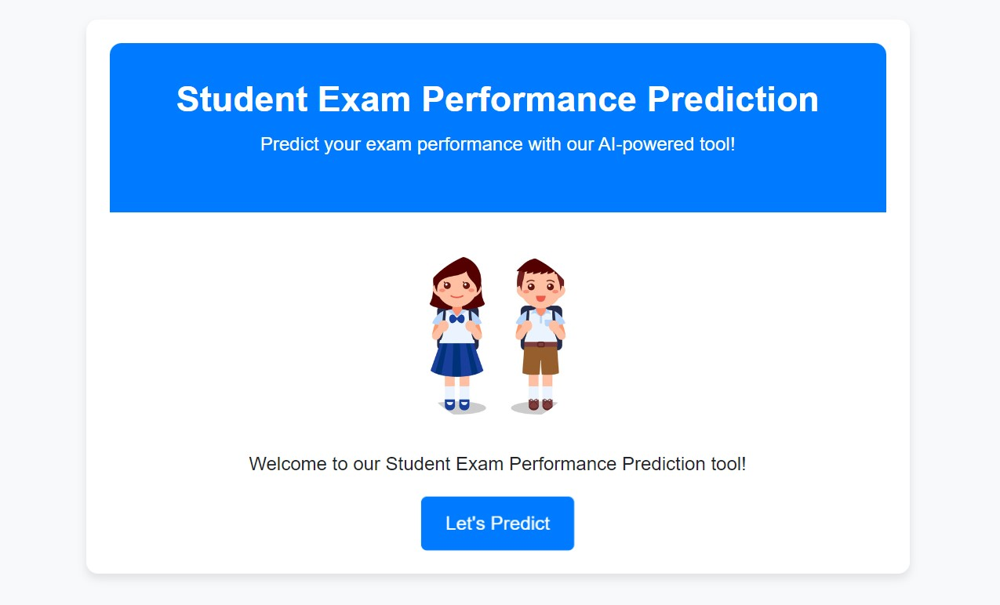
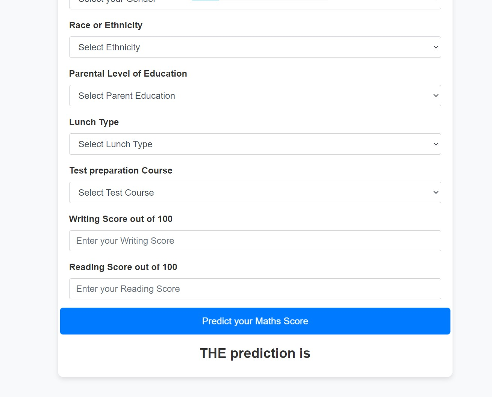

# Student Exam Performance Predictor
> AI powered tool created using **Flask** and following ML models like **K-Neighbors Regressor, Decision Tree ,Random Forest Regressor , XGBRegressor, CatBoosting Regressor, AdaBoost Regressor**

It is a fully feature ML Web app which predicts the Maths'score based on the different categorical and numerical features provided in the [dataset](notebook/data/stud.csv)

<!-- toc -->

<!-- tocstop -->

## Features

- Custom Exception Handling
- Logging
- [Exploratory Data Analysis (EDA)](https://github.com/shubhu-srk/MLProject/blob/b4c5a6500601684c29d1617219b875a1ee8fd136/notebook/1%20.%20EDA%20STUDENT%20PERFORMANCE%20.ipynb)
- Data Ingestion
- Data Transformation using Pipeline
- Model Training and Model Evaluation
- Prediction Pipeline and implementation using Flask App

## Results
- Web App results 
- Logging Results after successful Data Ingestion, Data Transfromation and Model Training and selects the best model based on R2 score. 
  

